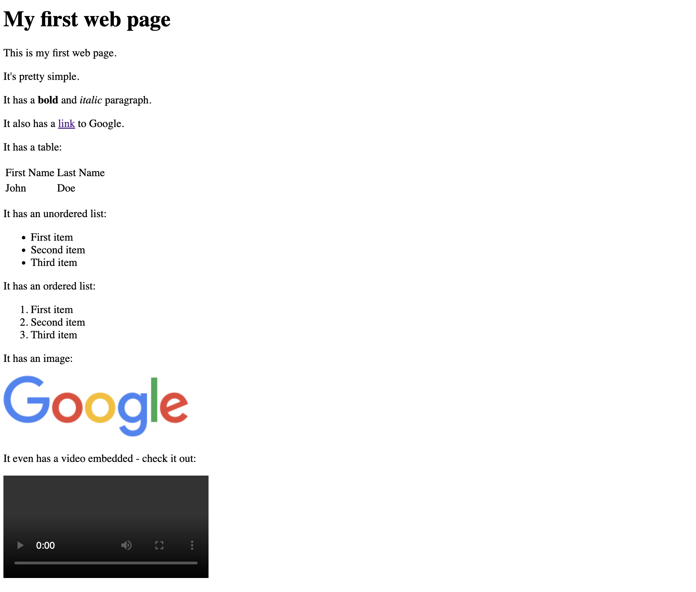

# Wrapping up section 1

Congratulations! You've made it to the end of section 1. You've learned a lot about HTML and how to use it to create web pages. Here is a code snippet that shows you how to use all the tags you've learned about in this section, along with some extra tags that you can use to add some extra functionality to your web pages:

```html
<!DOCTYPE html>
<html>
  <head>
    <title>My first web page</title>
  </head>
  <body>
    <h1>My first web page</h1>
    <p>This is my first web page.</p>
    <p>It's pretty simple.</p>
    <p>It has a <strong>bold</strong> and <em>italic</em> paragraph.</p>
    <p>It also has a <a href="https://www.google.com">link</a> to Google.</p>
    <p>It has a table:</p>
    <table>
      <tr>
        <td>First Name</td>
        <td>Last Name</td>
      </tr>
      <tr>
        <td>John</td>
        <td>Doe</td>
      </tr>
    </table>
    <p>It has an unordered list:</p>
    <ul>
      <li>First item</li>
      <li>Second item</li>
      <li>Third item</li>
    </ul>
    <p>It has an ordered list:</p>
    <ol>
      <li>First item</li>
      <li>Second item</li>
      <li>Third item</li>
    </ol>

    <p>It has an image:</p>
    

    <p>It even has a video embedded - check it out:</p>
    <video src="https://www.youtube.com/watch?v=dQw4w9WgXcQ" controls></video>
  </body>
</html>
```

This will create a web page that looks like this:



## Next steps

In the next section, you'll learn about CSS, which is used to style web pages. You'll learn how to use CSS to change the color of text, add borders to elements, and more. It's a lot of fun, and your site would look so much better!

[Let's dive into CSS! 🌈](../Section_2/Intro_to_CSS.md)