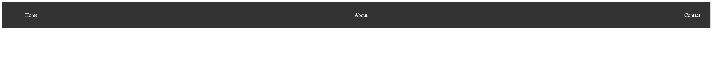

# Making your site fancy 💅

Now that you know the basics of HTML and CSS, let's make your site look a little nicer. Since you're making a portfolio, you'll want to make sure that it looks professional but also reflects your personality.

You can check out [my portfolio](https://cytronicoder.com) for some inspiration. You don't have to make your site look exactly like mine - this actually took way longer than 2 hours to make - but you can see what I did and use it as a starting point.

This section is a little more open-ended than the previous ones. You can do whatever you want to make your site look nicer. You can add more content, change the colors, add images, etc. The following are some suggestions to get you started. **Let's start!**

## Add a background image

You can add a background image to your site by adding the following CSS to your `index.css` file:

```css
body {
  background-image: url("../images/background.jpg");
  background-size: cover;
}
```

This will add the image `background.jpg` from the `assets/images` folder as the background image for your site. You can replace this image with any image you want. You can also change the `background-size` property to `contain` if you want the image to be scaled to fit the page.

## Add a header

You can add a header to your site by adding the following HTML to your `index.html` file:

```html
...
<body>
  <header>
    <h1>My Portfolio</h1>
  </header>
  ...
</body>
...
```

This will add a header to your site with the text "My Portfolio". You can change the text to whatever you want. You can also add more elements to the header, such as a navigation bar. You can find out more about the `<header>` element [here](https://developer.mozilla.org/en-US/docs/Web/HTML/Element/header).

### Why are we using a `<header>` element instead of a `<div>`?

The `<header>` element is a semantic element, which means that it has a specific meaning. This makes it easier for search engines to understand your site! You can find out more about semantic elements [here](https://developer.mozilla.org/en-US/docs/Glossary/Semantics).

## Add a footer

Similarly, you can add a footer to your site by adding the following HTML to your `index.html` file:

```html
...
<body>
  ...
  <footer>
    <p>© 2020 My Portfolio</p>
  </footer>
</body>
...
```

## Add a navigation bar

This is a little more complicated, so let's break it down into steps.

### Add a list of links

First, you'll need to add a list of links to your site. You can do this by adding the following HTML to your `index.html` file:

```html
<body>
  ...
  <nav>
    <ul>
      <li><a href="#">Home</a></li>
      <li><a href="#">About</a></li>
      <li><a href="#">Contact</a></li>
    </ul>
  </nav>
  ...
</body>
```

Check this out:

- The `<nav>` element is used to contain the navigation bar.
- The `<ul>` element is used to contain the unordered list of links.
- The `<li>` element is used to contain each individual link.
- The `<a>` element is used to link up your different pages. The `href` attribute is used to specify the URL of the page that the link should go to. You can use `#` to link to the current page.

### Add some CSS

If you save your file and open the HTML file in your browser, you'll see that... it looks pretty bland. Ew. Let's fix that - add the following CSS to your `index.css` file:

```css
nav {
  background-color: #333;
  color: #fff;
  padding: 1rem;
}

nav ul {
  list-style: none;
  display: flex;
  justify-content: space-between;
}

nav li {
  margin: 0 1rem;
}

nav a {
  color: #fff;
  text-decoration: none;
}

nav a:hover {
  text-decoration: underline;
}
```

Woah. That's a lot of CSS. Let's walk through it.

- The `nav` selector
  - `background-color` property used to set the background color
  - `color` property used to set the text color
  - `padding` property used to set the padding
- The `nav ul` selector
  - `list-style` property used to remove the bullet points
  - `display` property used to set the display type
  - `justify-content` property used to set the alignment
- The `nav li` selector
  - `margin` property used to set the margin
- The `nav a` selector
  - `color` property used to set the text color
  - `text-decoration` property used to remove the underline
  - On hover, the `text-decoration` property is set to `underline`

Now, if you save your file and open the HTML file in your browser, you'll see that your navigation bar looks a lot nicer! You can change the colors, the padding, the margin, etc. to make it look exactly how you want it to.

Of course, you'll need to add some links to your navigation bar. You can do this by adding the `href` attribute to the `<a>` elements. For example, if you want the "Home" link to go to the `index.html` file, you can add the following to the `<a>` element:

```html
<a href="index.html">Home</a>
```

Here's what it looks like:



## Bonus! Add a favicon

A favicon is a small icon that appears in the browser tab. For example, this is the favicon for my site:


That's it! You've made your site look a lot nicer. You can add more content, change the colors, add images, etc. to make it look exactly how you want it to.

## What's next?

Take some time to make your site look exactly how you want it to. You can add more content, change the colors, add images, etc. to make it look exactly how you want it to.

Once you're done, you can move on to the next section, where we'll learn [how to deploy our site to the web using GitHub Pages!](Lesson_2_Deploying_Your_Site.md)
