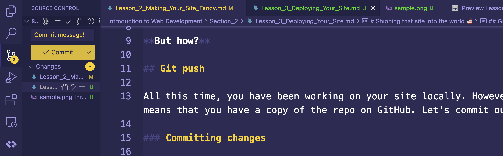
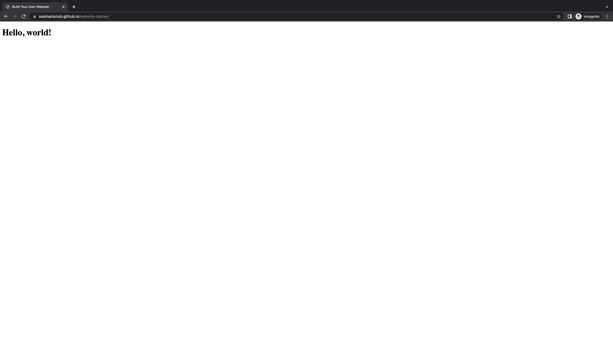

# Shipping that site into the world 🚢

It's time.

You've made your site, you've made it look nice, and now it's time to share it with the world.

Let's [get the f*ck off of localhost.](https://www.urbandictionary.com/define.php?term=GTFOL)

**But how?**

## Git push

All this time, you have been working on your site locally. However, remember that you forked the starter repo, which means that you have a copy of the repo on GitHub. Let's commit our changes and push them to GitHub.

### Committing changes

On VS Code, click on the Source Control tab on the left sidebar. You should see a list of files that have been changed. Click on the checkmark next to each file to stage it for commit. Then, write a commit message in the text box at the top and click the checkmark next to it to commit the changes.

Alternatively, you can use the keyboard shortcut `Ctrl + Shift + G` to open the Source Control tab and then use the keyboard shortcut `Ctrl + Enter` to commit the changes.

Alternatively alternatively, you can use the command line to commit the changes. First, run `git add .` to stage all the files for commit. Then, run `git commit -m "commit message"` to commit the changes.

### Pushing changes

Now that you've committed the changes, it's time to push them to GitHub. On VS Code, click on the Source Control tab on the left sidebar. Then, click on the three dots next to the commit message and click "Push".

Alternatively, you can use the command line to push the changes. Run `git push` to push the changes.

## Deploying your site

Now that you've pushed the changes to GitHub, it's time to deploy your site. We'll be using [GitHub Pages](https://pages.github.com/) to deploy our site. GitHub Pages is a free web host provided by GitHub. This is pretty cool, since everything we've done so far has been pushed to GitHub.

### Enabling GitHub Pages

Before we can deploy our site, we need to enable GitHub Pages. To do this, go to the settings page of your repo. Then, scroll down to the "GitHub Pages" section. Under "Source", select "master branch". Then, click "Save".

### Viewing your site

Now that you've enabled GitHub Pages, you can view your site by going to `https://<your username>.github.io/<your repo name>`. For example, the demo site is at `https://saishackclub.github.io/website-starter`.

## A little task for you

Now that you've deployed your site, share it with the gang over at the community and support chat! You have come a long way to make this work, and it's time to show it off. You're awesome 🤘

## What's next?

Now that you've deployed your site, you can share it with your friends and family. Of course, keep editing your site and making it look exactly how you want it to.

Now, what if we want to add some extra functionality to our site? For example, what if we want to add a contact form? Well, we can do that with JavaScript. Let's [learn about JavaScript.](../Section_3/Lesson_1_Intro_to_JS.md)
